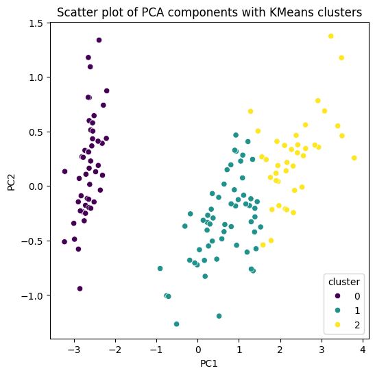

# KMeans Clustering Algorithm

## Overview

This is a simple implementation of the K-Means clustering algorithm in Python. K-Means is an unsupervised machine learning algorithm used for partitioning a dataset into K clusters.

## Usage

### Example

```python
from kmeans import KMeans
import matplotlib.pyplot as plt
import pandas as pd
import seaborn as sns
from sklearn import datasets
from sklearn.decomposition import PCA

# Load the Iris dataset
iris = datasets.load_iris()

# Initialize KMeans with the number of clusters (k=3)
kmeans = KMeans(k=3)

# Fit the KMeans model to the data
kmeans.fit(iris['data'])

# Predict the clusters for each data point
pred = kmeans.predict(iris['data'])

# Perform PCA for visualization
pca = PCA(n_components=2)
pca.fit(iris['data'])
X = pca.transform(iris['data'])

# Create a DataFrame for visualization
df = pd.DataFrame(X, columns=['PC1', 'PC2'])
df['cluster'] = pred

# Scatter plot with hue colors based on KMeans clusters
sns.scatterplot(x='PC1', y='PC2', data=df, hue='cluster', palette='viridis', legend='full')
plt.title('Scatter plot of PCA components with KMeans clusters')
plt.show()
```
### Example Output

The following scatter plot illustrates the result of applying the K-Means clustering algorithm to the Iris dataset using three clusters:



## Installation
To use this KMeans implementation, you can clone the repository and import the KMeans class into your project.

```bash
git clone https://github.com/your-username/kmeans.git
```

## Dependencies
NumPy
SciPy